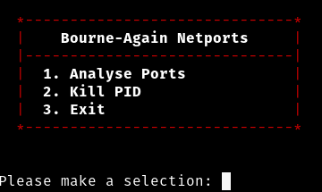

# Bourne-Again-Netports
A Bash shell script for simple analyis of open network ports, their associated PIDs and the option to kill that PID on the localhost for Linux.

<h2>Installation Guide</h2>

   <ul>Clone or Download the repository</ul>
   <ul>Go to the directory of the downloaded repository and configure permissions of the shell script using sudo chmod (Recommended: <b>sudo chmod 755 netports.sh</b>)</ul>
   <ul>Depending on your linux distribution, you may need to modify the shebang at the start of the script (#!). Use "which bash" in your terminal screen to determine where your bash installation is located and modify the shebang to suit.</ul>
   <ul>Execute the shell using <b>./netports.sh</b></ul>

<h2>Licensing</h2>

Bourne-Again-Netports is licensed under the GNU General Public License v3.0

